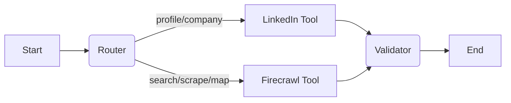

# Research Agent 🕵️‍♂️

The **Research Agent** is a specialized microservice within the Krastix ecosystem responsible for autonomous web research, scraping, and data gathering. It leverages **LangGraph** for workflow orchestration and integrates with external APIs like **Firecrawl** and **ScrapeCreators** to perform deep web analysis.

## 🏗 Architecture

The agent is built as a **FastAPI** service that processes research tasks asynchronously. It uses a graph-based state machine to manage the lifecycle of a research request.

### Core Components

1.  **Service Entry (`src/main.py`)**:
    -   Exposes a REST API (`/research/run`) to accept research tasks.
    -   Orchestrates background execution using standard `BackgroundTasks`.
    -   Chunks and pushes results to the central **Orchestrator**'s memory.

2.  **Graph Engine (`src/graph.py`)**:
    -   Built with **LangGraph**.
    -   Defines a stateful workflow: `Router` -> `Tool Execution` -> `Validator`.
    -   **State (`AgentState`)** tracks:
        -   `task_type`: The kind of research requested.
        -   `query_or_url`: The target.
        -   `raw_content`: The harvested data.
        -   `status` & `logs`: Execution metadata.

3.  **Tools (`src/tools.py`)**:
    -   **Firecrawl Integration**:
        -   `firecrawl_search`: General web search + news.
        -   `firecrawl_scrape`: Deep single-page scraping (markdown).
        -   `firecrawl_map`: Domain link mapping.
    -   **LinkedIn Integration** (via ScrapeCreators):
        -   `scrape_linkedin`: Retrieves Profile or Company data.

### Workflow Diagram



## 🚀 Getting Started

### Prerequisites

-   **Python 3.11+**
-   Docker (optional)
-   API Keys:
    -   `FIRECRAWL_API_KEY`: For web scraping/searching.
    -   `SCRAPECREATORS_API_KEY`: For LinkedIn data.

### Environment Variables

Create a `.env` file (or set these in your environment):

```ini
# API Keys (Required for specific tools)
FIRECRAWL_API_KEY=fc_...
SCRAPECREATORS_API_KEY=...

# Integration
ORCHESTRATOR_URL=http://orchestrator:8000
```

### Installation

#### Local Development
```bash
# Navigate to the folder
cd agents/research_agent

# Install dependencies
pip install -r requirements.txt

# Run the server
uvicorn src.main:app --host 0.0.0.0 --port 8001 --reload
```

#### Docker
```bash
# Build
docker build -t research-agent .

# Run
docker run -p 8001:8001 --env-file .env research-agent
```

## 📡 API Usage

### Health Check
`GET /health`
Returns the status of the service.

### Run Research Task
`POST /research/run`

Initiates an asynchronous research task. The agent will process the request and push the results to the Orchestrator when finished.

**Request Body:**
```json
{
  "user_id": "user_123",
  "task_type": "GENERAL_SEARCH",
  "query_or_url": "latest trends in AI agents",
  "context_metadata": {
    "project_id": "proj_001",
    "priority": "high"
  }
}
```

#### Supported `task_type` values:
-   `GENERAL_SEARCH`: Performs a web search and aggregates results.
-   `QUICK_SCRAPE`: Scrapes a single URL and converts to Markdown.
-   `SITE_MAP`: Maps the links of a domain.
-   `DEEP_CRAWL`: (Currently aliases to scrape) Intended for deeper traversal.
-   `LINKEDIN_PROFILE`: Scrapes a public LinkedIn profile URL.
-   `LINKEDIN_COMPANY`: Scrapes a LinkedIn company page.

## 📁 Directory Structure

```
research_agent/
├── Dockerfile              # Container definition
├── requirements.txt        # Python dependencies
└── src/
    ├── __init__.py
    ├── main.py             # FastAPI App & Background Logic
    ├── graph.py            # LangGraph Workflow Definition
    ├── tools.py            # Tool implementations (Firecrawl/LinkedIn)
    ├── models.py           # Pydantic Data Models
    └── __pycache__/
```

## 🔗 Orchestrator Integration

This agent expects an **Orchestrator** service explicitly available at `ORCHESTRATOR_URL`.
Upon task completion, data is chunked (1500 chars) and sent to:
`POST {ORCHESTRATOR_URL}/memory/ingest`
